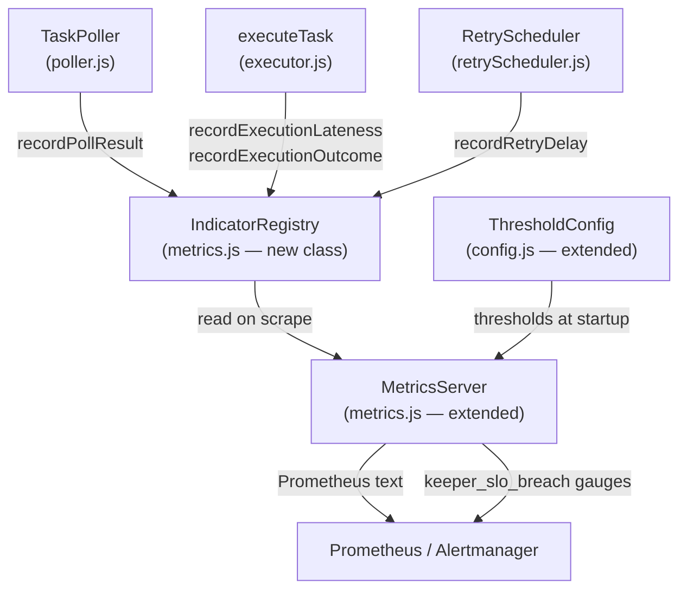

# Design Document: Backend Service Objectives

## Overview

This feature adds SLO-style observability to the keeper by defining and instrumenting four Service-Level Indicators (SLIs): Poll Freshness, Execution Lateness, Retry Delay, and success rates for both polls and executions. The metrics are exposed in Prometheus text format at the existing `/metrics/prometheus` endpoint, with suggested thresholds, SLO breach gauges, and documented measurement limitations.

The design extends the existing `MetricsServer` / `Metrics` class pair in `keeper/src/metrics.js` rather than introducing a new service. New instrumentation hooks are added to `poller.js`, `executor.js`, and `retryScheduler.js` at the points where timing information is already available.

## Architecture



The `IndicatorRegistry` is a new class that lives inside `metrics.js`. It owns all rolling-window sample storage and percentile computation. `MetricsServer` holds an `IndicatorRegistry` instance and reads from it when generating the Prometheus scrape response.

## Components and Interfaces

### IndicatorRegistry

Responsible for storing time-series samples and computing derived values.

```js
class IndicatorRegistry {
  // Record that a poll completed (success=true) or failed (success=false)
  recordPollResult(success: boolean, timestampMs?: number): void

  // Record the lateness of a single execution submission
  // outcome: 'success' | 'failure'
  recordExecutionLateness(latenessSeconds: number, outcome: 'success' | 'failure'): void

  // Record the delay between failure detection and retry start for a task
  recordRetryDelay(taskId: string | number, delaySeconds: number): void

  // Compute Poll_Freshness as seconds since last successful poll
  // Returns null if no successful poll has been recorded yet
  getPollFreshness(nowMs?: number): number | null

  // Compute percentiles over the rolling sample window
  getExecutionLatenessPercentiles(): { p50: number, p95: number, p99: number }
  getRetryDelayPercentiles(): { p50: number, p95: number }

  // Compute success rates within the Measurement_Window
  getExecutionSuccessRate(): number   // [0.0, 1.0]
  getPollSuccessRate(): number        // [0.0, 1.0]

  // Retrieve the last N samples for a given indicator (for histogram buckets)
  getExecutionLatenessSamples(outcome?: 'success' | 'failure'): number[]
}
```

**Sample storage**: Each indicator keeps a fixed-size circular buffer of the last 1000 samples (requirement 1.6). Samples older than the `Measurement_Window` (default 5 minutes) are excluded from rate and percentile computations but retained in the buffer until evicted by newer samples.

**Percentile algorithm**: Samples are sorted in-place on each read. For low-volume scenarios this is acceptable; the buffer cap of 1000 keeps worst-case sort time bounded.

### MetricsServer extensions

New Prometheus metrics registered in `initPrometheusMetrics()`:

| Metric name | Type | Description |
|---|---|---|
| `keeper_poll_freshness_seconds` | Gauge | Seconds since last successful poll |
| `keeper_execution_lateness_seconds` (histogram) | Histogram | Lateness at submission time, bucketed |
| `keeper_execution_lateness_p50_seconds` | Gauge | p50 of execution lateness |
| `keeper_execution_lateness_p95_seconds` | Gauge | p95 of execution lateness |
| `keeper_execution_lateness_p99_seconds` | Gauge | p99 of execution lateness |
| `keeper_retry_delay_p50_seconds` | Gauge | p50 of retry delay |
| `keeper_retry_delay_p95_seconds` | Gauge | p95 of retry delay |
| `keeper_execution_success_rate` | Gauge | Ratio of successful executions in window |
| `keeper_poll_success_rate` | Gauge | Ratio of successful polls in window |
| `keeper_slo_breach` | Gauge | 1 if current value exceeds threshold, 0 otherwise (label: `sli`) |
| `keeper_slo_threshold` | Gauge | Configured threshold value per SLI (label: `sli`) |
| `keeper_build_info` | Gauge | Version and config labels (already planned, now required) |

The histogram for `keeper_execution_lateness_seconds` uses configurable bucket boundaries defaulting to `[0, 1, 5, 10, 30, 60, 120, 300]` seconds.

Labels on `keeper_slo_breach` and `keeper_slo_threshold` use the `sli` label with values: `poll_freshness`, `execution_lateness`, `execution_success_rate`, `poll_success_rate`, `retry_delay`. No raw `task_id` values appear in any label set (requirement 5.7).

### Instrumentation call sites

**poller.js — `pollDueTasks()`**:
- On successful completion: `metricsServer.indicatorRegistry.recordPollResult(true)`
- On catch (fatal error): `metricsServer.indicatorRegistry.recordPollResult(false)`
- The existing `metricsServer.updateHealth({ lastPollAt })` call is retained for backward compatibility.

**executor.js — `executeTask()` / `executeTaskWithRetry()`**:
- Before submitting: compute `latenessSeconds = (Date.now() / 1000) - task.dueTime`; clamp to `Math.max(0, latenessSeconds)`
- After result: `metricsServer.indicatorRegistry.recordExecutionLateness(latenessSeconds, outcome)`
- Emit structured warning log if lateness exceeds threshold (requirement 3.5).

**retryScheduler.js — `scheduleRetry()` and `completeRetry()`**:
- In `scheduleRetry()`: store `failureDetectedAt = Date.now()` on the retry metadata (already has `createdAt`; rename/alias).
- In `completeRetry()` when a retry attempt begins: compute `delaySeconds = (Date.now() - metadata.failureDetectedAt) / 1000`; call `metricsServer.indicatorRegistry.recordRetryDelay(taskId, delaySeconds)`.

### ThresholdConfig

New fields added to `loadConfig()` in `config.js`:

```js
sloThresholds: {
  stalePollSeconds:          parseInteger(process.env.SLO_STALE_POLL_SECONDS, 30),
  executionLatenessSeconds:  parseInteger(process.env.SLO_EXECUTION_LATENESS_SECONDS, 60),
  maxRetryDelaySeconds:      parseInteger(process.env.SLO_MAX_RETRY_DELAY_SECONDS, 120),
  minExecutionSuccessRate:   parseFloat(process.env.SLO_MIN_EXECUTION_SUCCESS_RATE) || 0.95,
  minPollSuccessRate:        parseFloat(process.env.SLO_MIN_POLL_SUCCESS_RATE) || 0.99,
}
```

At startup, the keeper logs all active threshold values (requirement 6.6).

## Data Models

### SampleBuffer

```js
{
  samples: Float64Array,   // circular buffer, length = maxSamples (1000)
  head: number,            // next write index
  count: number,           // total samples written (capped at maxSamples)
  timestamps: Float64Array // wall-clock ms for each sample (same index)
}
```

### PollRecord

```js
{
  lastSuccessfulPollMs: number | null,  // wall-clock ms of last successful poll
  totalPolls: number,
  successfulPolls: number,
  windowPolls: SampleBuffer            // 1 = success, 0 = failure, for rate computation
}
```

### RetryRecord (stored in retryScheduler's retryQueue Map)

Extends existing `retryMetadata` with:
```js
{
  failureDetectedAt: number   // Date.now() at scheduleRetry() call time
}
```

### SLO Breach State

Computed on each Prometheus scrape from live `IndicatorRegistry` values vs. `ThresholdConfig`. Not persisted.

## Correctness Properties

*A property is a characteristic or behavior that should hold true across all valid executions of a system — essentially, a formal statement about what the system should do. Properties serve as the bridge between human-readable specifications and machine-verifiable correctness guarantees.*

### Property 1: Poll Freshness is non-negative

*For any* sequence of poll result recordings and any wall-clock time at or after the last successful poll, the computed Poll_Freshness value must be greater than or equal to zero.

**Validates: Requirements 9.1, 2.3**

### Property 2: Execution Lateness is non-negative

*For any* task due time and submission time, the recorded Execution_Lateness value must be greater than or equal to zero. Negative computed durations (e.g., from clock skew) must be clamped to zero before recording.

**Validates: Requirements 9.2, 9.7, 3.1**

### Property 3: Success rates are bounded

*For any* sequence of execution or poll outcome recordings, the computed success rate must always be in the range [0.0, 1.0] inclusive.

**Validates: Requirements 9.3, 1.4, 1.5**

### Property 4: Lateness percentile round-trip

*For any* non-empty set of lateness samples recorded into the IndicatorRegistry, the p50 percentile returned must be a value that exists within the recorded sample set (i.e., the percentile is drawn from actual observations, not extrapolated outside the range).

**Validates: Requirements 9.4, 3.3**

### Property 5: Metrics endpoint idempotence

*For any* IndicatorRegistry state with no new events recorded between two consecutive scrapes, the Prometheus text output of both scrapes must be identical.

**Validates: Requirements 9.5, 5.5**

### Property 6: Lateness percentiles are order-independent

*For any* set of N lateness samples, recording them in any permutation produces the same p50, p95, and p99 percentile values.

**Validates: Requirements 9.6, 3.3**

## Error Handling

**Clock skew / negative durations**: Any computed duration (lateness, freshness, retry delay) that is negative is clamped to zero before being recorded or exposed. A debug-level log is emitted when clamping occurs.

**No data yet (pre-first-poll)**: `getPollFreshness()` returns `null` before any poll completes. `MetricsServer` exposes this as a sentinel value of `-1` on the `keeper_poll_freshness_seconds` gauge, which alert rules can filter with `>= 0` guards (requirement 2.4).

**Metrics endpoint disabled**: When `METRICS_ENABLED=false` (or the port is not configured), `MetricsServer` skips starting the HTTP server. The `IndicatorRegistry` is still instantiated but `recordXxx()` calls become no-ops, so there is zero overhead on the hot path (requirement 8.5).

**Scrape timeout**: The `/metrics/prometheus` handler already runs synchronously after `syncPrometheusMetrics()`. Percentile computation over at most 1000 samples is O(N log N) ≈ microseconds, well within the 500ms budget (requirement 5.5).

**Invalid sample values**: `recordExecutionLateness` and `recordRetryDelay` validate that the input is a finite number ≥ 0. Non-finite or negative values are rejected with a warning log and not stored.

## Testing Strategy

### Unit tests (Jest)

- `IndicatorRegistry` in isolation: verify `getPollFreshness()` returns `null` before first poll, returns correct elapsed time after recording, and returns a non-negative value after clock-skew clamping.
- Success rate computation: verify 0/0 returns 1.0 (no data = not failing), verify boundary values 0 and 1.
- Threshold config loading: verify defaults, verify env-var overrides, verify startup log contains all active values.
- `MetricsServer` Prometheus output: snapshot test that all required metric names, HELP lines, and TYPE annotations are present.
- SLO breach gauge: verify it is 1 when value exceeds threshold and 0 when below.

### Property-based tests (fast-check)

The keeper already uses Jest. `fast-check` integrates directly with Jest via `fc.assert` / `fc.property` and requires no additional test runner configuration.

Install: `npm install --save-dev fast-check` in the `keeper/` directory.

Each property test runs a minimum of 100 iterations (fast-check default is 100; set `numRuns: 100` explicitly).

Tag format in test comments: `Feature: backend-service-objectives, Property N: <property text>`

**Property 1 test** — `Feature: backend-service-objectives, Property 1: Poll Freshness is non-negative`
Generate: random sequence of poll results (boolean[]), random `nowMs` ≥ last success timestamp.
Assert: `getPollFreshness(nowMs) >= 0` whenever a successful poll exists.

**Property 2 test** — `Feature: backend-service-objectives, Property 2: Execution Lateness is non-negative`
Generate: random `dueTime` (unix seconds), random `submissionTime` (may be before dueTime to simulate skew).
Assert: after calling `recordExecutionLateness(Math.max(0, submissionTime - dueTime), 'success')`, all samples in the buffer are `>= 0`.

**Property 3 test** — `Feature: backend-service-objectives, Property 3: Success rates are bounded`
Generate: random arrays of boolean outcomes (length 0–1000).
Assert: `getExecutionSuccessRate()` and `getPollSuccessRate()` are always in `[0.0, 1.0]`.

**Property 4 test** — `Feature: backend-service-objectives, Property 4: Lateness percentile round-trip`
Generate: non-empty array of non-negative floats (length 1–1000).
Assert: `getExecutionLatenessPercentiles().p50` is a value that appears in the sorted sample array (within floating-point epsilon).

**Property 5 test** — `Feature: backend-service-objectives, Property 5: Metrics endpoint idempotence`
Generate: random IndicatorRegistry state (fixed set of recorded samples).
Assert: calling `syncPrometheusMetrics()` twice without new recordings produces the same gauge values both times.

**Property 6 test** — `Feature: backend-service-objectives, Property 6: Lateness percentiles are order-independent`
Generate: array of non-negative floats (length 1–200), two random shuffles of that array.
Assert: percentiles computed after recording shuffle A equal percentiles computed after recording shuffle B (same multiset, different order).
